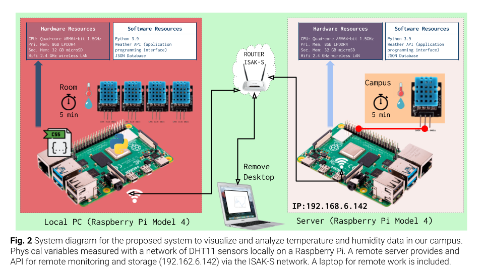

*Post, The Huffington. “ガチャピン、放送事故で透明に。松雪彩花アナのフォローに「神対応」の声.” ハフポスト, ハフポスト, 5 Feb. 2016, https://www.huffingtonpost.jp/2016/02/05/gachapin-weathernews_n_9173020.html.*

# Unit 2: A Distributed Weather Station for ISAK

## Criteria A: Planning

### Problem definition
Daiichiro is a parent who has a student at ISAK. He is very concerned about his son's recent health problems. He is a data scientist, so he is very logical and only believes in data. And he wants data on the indoor and outdoor temperature and humidity in his son's room for 48 hours. And that data needs to be more accurate. And since the budget he is giving me is small, I need to get the resources at a low price.


### Proposed Solution
Considering the client requirements an adequate solution includes a low cost sensing device for humidity and temperature and a custom data script that process and anaysis the samples acquired. For a low cost sensing device an adequate alternative is the DHT11 sensor[^1] which is offered online for less than 5 USD and provides adequare precision and range for the client requirements (Temperature Range: 0°C to 50°C, Humidity Range: 20% to 90%). Similar devices such as the DHT22, AHT20 or the AM2301B [^2] have higher specifications, however the DHT11 uses a simple serial communication (SPI) rather than more eleborated protocols such as the I2C used by the alternatives. For the range, precision and accuracy required in this applicaiton the DHT11 provides the best compromise. Connecting the DHT11 sensor to a computer requires a device that provides a Serial Port communication. A cheap and often used alternative for prototyping is the Arduino UNO microcontroller [^3]. "Arduino is an open-source electronics platform based on easy-to-use hardware and software"[^4]. In additon to the low cost of the Arduino (< 6USD), this devide is programable and expandable[^1]. Other alternatives include diffeerent versions of the original Arduino but their size and price make them a less adequate solution.

Considering the client's budget constraints and hardware requirements, the software tool proposed for this solution was Python, which is open source, mature, supported on multiple platforms including macOS, Windows, and can be used for programming Arduino microprocessors56. It can also be used for programming the Arduino microprocessor56. It also has many developer tools available, making it easy to obtain information about problems that are difficult to solve.6 Python is a High Level Programming Language (HLL) with a higher level of abstraction than C or C++.7 For example, a C/C++ developer can allocate and free memory, whereas in Python, memory management is automatic, which can speed up applications, but can also cause memory problems. Furthermore, the HLL language allows me and future developers to extend the solution and solve problems quickly.

**Design statement**
Design Statement, We are creating a poster for our client, daiichirom. To do this, we need certain statistical data. That data will include a system diagram, a 48-hour visual representation and model of humidity and temperature in ISAK's rooms and ISAK's remote indoor areas, and a forecast for the next 12 hours. Health implications for humidity and temperature levels are also presented. This will be realized with the software Python on a Raspberry Pi. The project will be produced in approximately one month and will be evaluated on the following six criteria

[^1]: Industries, Adafruit. “DHT11 Basic Temperature-Humidity Sensor + Extras.” Adafruit Industries Blog RSS, https://www.adafruit.com/product/386. 
[^2]: Nelson, Carter. “Modern Replacements for DHT11 and dht22 Sensors.” Adafruit Learning System, https://learn.adafruit.com/modern-replacements-for-dht11-dht22-sensors/what-are-better-alternatives.   
[^3]:“How to Connect dht11 Sensor with Arduino Uno.” Arduino Project Hub, https://create.arduino.cc/projecthub/pibots555/how-to-connect-dht11-sensor-with-arduino-uno-f4d239.  
[^4]:Team, The Arduino. “What Is Arduino?: Arduino Documentation.” Arduino Documentation | Arduino Documentation, https://docs.arduino.cc/learn/starting-guide/whats-arduino.  

## Success Criteria

1. The solution provides a visual representation of the Humidity and Temperature values inside a dormitory (Local) and outside the house (Remote) for a period of minimum 48 hours. 
1. ```[HL]``` The local variables will be measure using a set of 4 sensors around the dormitory.
2. The solution provides a mathematical modelling for the Humidity and Temperature levels for each Local and Remote locations. ```(SL: linear model)```, ```(HL: non-lineal model)```
3. The solution provides a comparative analysis for the Humidity and Temperature levels for each Local and Remote locations including mean, standad deviation, minimum, maximum, and median.
4. ```(SL)```The Local samples are stored in a csv file and ```(HL)``` posted to the remote server.
5. Create a prediction the subsequent 12 hours for both temperature and humidity.
6. A poster summarizing the visual representations, model and analysis is created and communicated.

# Criteria B: Design

### System Diagram **HL**



**Fig.2** shows the system diagram for the proposed solution (**HL**). The indoor variables will be measured using a Raspberry PI and four DHT11 sensors located inside a room. Four sensors are used to determine more precisely the physical values and include measurement uncertainty. The outdoor variables will be requested to the remote server using a GET request to the API of the server at ```192.168.6.147/readings```. The local values are stored in a CSV database locally and POST to the server using the API and TOKEN authentication. A laptop computer is used for remotely controlling the local Rasberry Pi using a Dekptop sharing application (VNC Viewer). (Optional) Data from the local raspberry is downloaded to the laptop for analysis and processing.


## How data is stored
We stored the temperature and humidity data  in both seperate database csv files, and sent the datas to the sensors created in the server everytime the set of data is collected

## Flow Diagram 1 - Main File


**Fig.3** shows the flow diagram of the main file that collects datas from the server and stores them into csv files and sends them to the server.

## Flow Diagram 2 - Server Creation


**Fig.4** shows the flow diagram of the initiation of accounts for the servers and sensors.

## Flow Diagram 3 - MVP

**Fig.5** shows the flow diagrams for the minimum viable product for the project.

### Record of Tasks
| Task No | Planned Action                                                | Planned Outcome                                                                                                 | Time estimate | Target completion date | Criterion |
|---------|---------------------------------------------------------------|-----------------------------------------------------------------------------------------------------------------|---------------|------------------------|-----------|
|       | meet with client　  | Talk with the client to dicuss the problems they are facing and brainstorm solutions to create a plan to help the client resolve the problems　|  15min | Nov 22| A
|       |Brainstorm and write the problem definition| Both write problem definition and organize files for this program in githab| 30min| Nov 22 |B
|       | Wirte Design statement | A clear outline of the final goal of the project and the components to be completed | 60min |Nov 23
|       | Gathering materials and assigning tasks to the scope of work |Procure the materials needed to build the equipment to measure temperature and humidity in the dormitory and bring the materials back home with the sole intention of building a weather station for the client  | 60min |Nov
|       |Write the Problem context             |we understood how the code works          |  10min          |  Nov 24         | A 
|       |research about raspberry pi                      |research about raspberry pi features and benefits and what can be implemented          |  25min         |  Nov 29         | A
|        |Write code for program                           |  We wrote code so that the sensor could periodically measure humidity and temperature.        |  45min          |  Nov 30         | A 
|    |Test run for sensor |Write and run a code that measures once every 5 seconds for testing.| 60min | Nov 30| A
|    |We wired the raspberry pi, sensors and raspberry pi| Using a breadboard, I was able to wire accurately | 45min | Nov 30| A 
|    |Connect raspberry pi to computer and test run of sensors. | Check that the connection between the sensor and the Raspberry Pi is made properly. Complete the temporary assembly of the device. | 80 min | Dec 1 | A
|    |Create MVP | After confirming that the basic structure and function of the product is working properly, we move on to the final finished product. | 80 min | B
|    |  Register user to server and obtain access code. | Create a user with a secure username and password to access the server. Obtain an access code to log in to the server and be able to post | 70min | Dec 1 | C
|    |We wired the raspberry pi, sensors and raspberry pi| Using a breadboard, I was able to wire accurately | 45min | Dec 1| A
|    | Make cron tab |This is to ensure that DHT's sensors send data to the computer at 5 minute intervals.	| 45 min | Dec 1 |C
|    |Create a system that "uploads the obtained data to the server | Transmits humidity and temperature data to server every 5 minutesv    |  120min  | Dec 3 |B
|   |Run code for 48 hours in order to collect temperature and humidity data in R2-12 A.| Take R2-12A humidity and temperature data at 5-minute intervals for 48 hours.| 48 hrs |Dec 3-5 |C
| |Unexplained trouble, code stops.And fixed|It was discovered that the WIfi connection had been lost in the process. Additional necessary tools were installed to solve the problem.|  210 min |Dec 6 |B
|   | Draw 3 flow diagrams of aspects of code.　| I drew FLOW diagrams for the MVP, the server code, and the overall code. | 200min | Dec 7 |A
| | Find out the appropriate temperature and humidity for human living | To obtain criteria for determining appropriate/inappropriate humidity and temperature levels on the UWC ISAK campus | 30 min |Dec 7 | B
|  |Collect data from outdoor sensors|To compare outdoor indoor temperature changes from the posted data. |    180 min | Dec 7 | A
| | Create coding to graph school and room temperature and humidity data | Create a scatter plot graph using a nonlinear best-fit function|110 min | Dec 8 | B
|  |Pilot graphing of data | Use outdoor data and apply it to the code you have created. | 50 min | Dec 8 | A
|  |Coding prototype graphing for one specific data | When plotting graphs from all sensors and the average of one specific set of data (room temperature)| 80 min | Dec 9 | B
|   |Outline video outlines, summarize data and images, and present the final product/solution.| Gather all information necessary to create an organized video to showcase the product. | 80 min | Dec 9 | B
|  | Find out how to write a science poster | Research to write to cover the Criteria | 50 min | Dec 9 |A


## Test Plan
| Software Test Type | Input | Process | Planned Output  |
|------|-------------|----------|---------|
| Integration Testing | Raspberry Pi and VNC Viewer | 1. Download vnc viewer. 2. Input raspberry pi address into vnc viewer. 3. Access raspberry pi through VNC viewer using username and password. | VNC viewer will authenticate username and password and be able to connect to raspberry pi remotely. |
| Unit Testing | Code to receive information from DHT sensor | 1. Run code. 2. Wait for output from DHT sensor. | Confirm that DHT sensor is functioning properly.|

# Criteria C: Development

### List of techniques used
| Technique |
|-----------|
| Posting to a remote server with server API. |
| Retrieving data from a remote server with server API and requests library. |
| For loops in order to run code under certain conditions. For example, to get readings for multiple DHT11 sensors with one for loop of code. Utilizing a for loop is more efficient than creating a code for each sensor separately. |
| Creating lists (in order to save data from DHT11 sensors by temperature and humidity). |
| Creating CSV files (in order to save data from DHT11 sensors by temperature and humidity). |
| Plot median, mean, maximum, minimum, standard deviation and a non linear model using python. |
| Predicting temperature and humidity values based on line of best fit equation (non linear model). |
| Smoothing data on a graph. |


### Development

### Main File
```.py
import requests
import Adafruit_DHT
import datetime
import time

user = {'username': 'masamu','password':'123'}
req = requests.post('http://192.168.6.142/login',json = user)
access_token = req.json()['access_token']
print(req.json())
auth = {"Authorization": f"Bearer {access_token}"}

def convert(a):
    if a == 2:
        return 0
    if a == 3:
        return 1
    if a == 4:
        return 2
    if a == 17:
        return 3
    
    
def sensor(a):
    today = datetime.datetime.now()
    DHT_SENSOR = Adafruit_DHT.DHT11
    DHT_PIN = a
    humidity,temperature = Adafruit_DHT.read(DHT_SENSOR,DHT_PIN)
    while humidity == 'null' or temperature == 'null':
        humidity,temperature = Adafruit_DHT.read(DHT_SENSOR,DHT_PIN)
    
    new_record ={"datetime":str(datetime.datetime.now()),"sensor_id":472 + convert(a), "value":humidity}
    r = requests.post('http://192.168.6.142/reading/new', json=new_record, headers=auth)
    
    print(r.json())
    new_record ={"datetime":str(datetime.datetime.now()),"sensor_id":476 + convert(a), "value":temperature}
    r = requests.post('http://192.168.6.142/reading/new', json=new_record, headers=auth)
    print(r.json())

    
#    time.sleep(1)


for i in range(0,172801,300):
    sensor(2)
    sensor(3)
    sensor(4)
    sensor(17)
    time.sleep(300)
```

### MVP-Minimum Viable Product
As a prototype for a method of measuring and collecting temperature and humidity data, we have created MVP, which runs in Python code on a Raspberry Pi connected to a single DHT sensor. This code allows the Raspberry Pi to read a set of temperature and humidity data from the DHT sensor and display it as output on the terminal. For more information, see the Python code below.


```.py
    
def sensor(a):
    today = datetime.datetime.now()
    DHT_SENSOR = Adafruit_DHT.DHT11
    DHT_PIN = a
    humidity,temperature = Adafruit_DHT.read(DHT_SENSOR,DHT_PIN)
  　　　　while humidity == None or temperature == None:
        humidity,temperature = Adafruit_DHT.read(DHT_SENSOR,DHT_PIN)
 
```
### Server initialization
Logging in, registering and creating 8 sensors in the server. Code is as below:
```.py
import requests

'''
new_user = {'username': 'masamu','password':'123'}
req = requests.post('http://192.168.6.142/register',json = new_user)
print(req.json())
'''

user = {'username': 'masamu','password':'123'}
req = requests.post('http://192.168.6.142/login',json = user)
access_token = req.json()['access_token']
print(req.json())


'''auth = {"Authorization": f"Bearer {access_token}"}

count = 0
for i in range(1,9):
    if i >= 5:
        type = 'Temperature'
        unit = 'C'
    else:
        type = 'Humidity'
        unit = '%'
    sensorname = f'sensor_masagen_{type}_{i}'
    print(i,type,sensorname)
    new_sensor ={ "type": type,"location": "R2-12A", "name": sensorname,"unit":unit }
    r = requests.post('http://192.168.6.142/sensor/new', json=new_sensor, headers=auth)
    print(r.json())'''


auth = {"Authorization": f"Bearer {access_token}"}
'''
new_sensor ={ "type": 'Temperature',"location": "R2-12A", "name": 'masamu_test',"unit":'C' }
r = requests.post('http://192.168.6.142/sensor/new', json=new_sensor, headers=auth)
print(r.json())
'''
r = requests.get('http://192.168.6.142/sensors')
print(r.json()['readings'])
for i in r.json()['readings'][0]:
    if i['owner_id'] == 10:
        print(i)


r = requests.get('http://192.168.6.142/user/readings', headers=auth)
print(r.json())
for i in r.json():
    print(i)

```
# Criteria D: Functionality

A 7 min video demonstrating the proposed solution with narration
